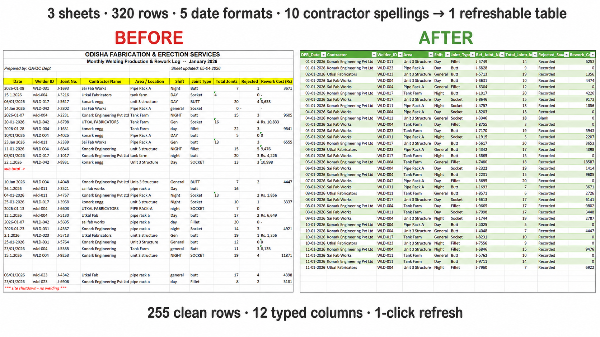

# Messy Monthly Sheets to a Refreshable Dataset

**The source file could not produce its own totals. 121 of 255 rework-cost values and 47 of 255 joint counts were stored as text, so any pivot built over the raw data would silently skip them.**

---

## The problem

Most small operations do not have a data problem. They have a *file* problem — one workbook three people type into, with merged headers, dates stored as text, four spellings of the same supplier, and totals that quietly stopped being right.

Here it was three monthly fabrication DPR sheets. Presentation formatting, note rows, blank separators and footer text sitting inside the data range. Before any contractor, welder or rework-cost analysis could begin, somebody had to clean it — and then do the same thing again next month.

The expensive part is not the time. It is that manual repair changes the answer: dates reverse by locale, one contractor splits into three groups through spelling variation, and numeric-looking text drops out of a total without warning.

*Synthetic dataset, modelled on real fabrication DPR structure. Contractor, welder and area names are invented.*

---

## What was wrong with it

Three sheets, **320 occupied rows**, of which only **255 were actual records**. The other 65 were title blocks, headers, blanks, subtotals and footer text.

| Defect | Extent |
|---|---|
| Merged four-row title blocks | 3 sheets |
| Blank separator rows inside data | 34 |
| Junk text, subtotal and footer rows | 16 |
| Date formats in one text column | 5 |
| Contractor spellings for 3 contractors | 10 |
| Welder-ID spellings for 6 welders | 11 |
| Area / shift / joint-type spellings | 9 / 9 / 8 |
| Values with trailing whitespace | 54 |
| `Total Joints` stored as text | 47 of 255 |
| `Rework Cost` stored as text | 121 of 255 |
| Zero represented as blank, `-`, `nil`, `NIL` | throughout |

None of these are typos. They are systematic faults that return in every future month's file — which is why the fix had to be a pipeline, not a repair.

---

## What I built

1. **A query per monthly sheet**, stripping presentation rows before promoting real headers
2. **`Source_Month` stamped before the append**, so month context survives inconsistent sheet naming
3. **Non-data rows removed by record logic** — filtering where `Welder_ID` is null — rather than by a fragile list of note text to delete
4. **All five date patterns parsed and validated against their source month**, which is what prevents a silent US/India reversal
5. **Judgement-based mappings held in visible lookup tables** — `konark engg` and `Konark Engineering Pvt Ltd` are one contractor, `Gen` means `General` — so the decisions stay auditable
6. **Numeric fields typed only after stripping prefixes and separators**, with a `Rejected_Source` field recording whether a zero was entered or inferred

Output: **255 rows, 12 typed columns, one `Fact_Welding` table**, refreshable in one click.

---

## What the clean data showed

- **3,202 joints welded, 513 rejected — a 16.0% rejection rate**
- **₹11,56,403 total rework cost** across 6 welders and 3 contractors
- **Sai Fab Works** carried the highest total rework cost, driven by volume
- **Utkal Fabricators** had the highest rejection rate — the different, more actionable problem
- **Unit 3 Structure** was the worst-performing area

That distinction between highest cost and highest rate is what decides where corrective action goes, and it was unreachable while three contractors were spread across ten spellings.

---

## Tools

Excel 365 · Power Query (M) · Pivot Tables

## Files

| File | What it is |
|---|---|
| `01_before_messy.xlsx` | The original file, unmodified |
| `02_after_clean.xlsx` | The refreshable workbook |
| `case_study.md` / `case_study.pdf` | Full write-up |
| `defect_log.md` | Every defect found, with counts and how it was fixed |
| `images/` | Before and after screenshots |

---

*I spent 12 years in QA/QC on refinery, steel plant and fabrication projects — IOCL Paradip, Jindal Steel Angul, Tata Steel HSM. I have built and repaired more site reporting spreadsheets than I can count. This is what I wish they had been.*

**Contact:** skbiswal5244@gmail.com
